# Pengantar Konsep Pemrograman Berorientasi Objek

<h4>Nama : Hafidza Tsamara Z. 
NIM : 254107020034 
Kelas : TI-2G 
Repository [link] : https://github.com/hafidzatsamarazahra-dev/PBO.git <h4>

## Hasil percobaan 1

## Hasil percobaan 2

## Pertanyan
1. Jelaskan perbedaan antara object dengan class!
2. Jelaskan alasan gear dan brand dapat menjadi atribut dari object Bike!
3. Sebutkan salah satu kelebihan utama dari pemrograman berorientasi objek dibandingkan
dengan pemrograman prosedural!
4. Apakah diperbolehkan melakukan pendefinisian dua buah atribut dalam satu baris kode seperti
“public String nama, alamat;”?
5. Pada class RoadBike, jelaskan alasan atribut brand, speed, dan gear tidak lagi ditulis di dalam
class tersebut! 

### Jawaban
1. Class adalah blueprint atau rancangan yang digunakan untuk membuat object. Sedangkan object adalah hasil atau bentuk nyata dari class yang memiliki atribut dan dapat menjalankan method.
2. Karena gear dan brand merupakan informasi yang dimiliki oleh sebuah sepeda. Pada class Bike, brand digunakan untuk menyimpan merek sepeda, sedangkan gear digunakan untuk menyimpan posisi gigi sepeda. Jadi, keduanya cocok dijadikan atribut dari object Bike.
3. Salah satu kelebihannya adalah kode dapat digunakan kembali melalui konsep seperti inheritance. Contohnya pada program ini, class RoadBike bisa menggunakan atribut dan method yang ada di class Bike tanpa harus menulisnya ulang.
4. Ya boleh. Dua atribut dengan tipe data yang sama bisa ditulis dalam satu baris. Contohnya 

        public String nama,alamat; 

    sama seperti menuliskan 

        public String nama;
        public String alamat; 

    secara terpisah.
5. Karena RoadBike merupakan turunan dari class Bike dengan menggunakan extends Bike. Jadi, RoadBike bisa menggunakan method dari Bike, seperti setBrand(), speedAcceleration(), gearChanges(), dan printInfo(). Atribut brand, speed, dan gear juga berasal dari class Bike, sehingga tidak perlu dibuat ulang di RoadBike.

## Tugas Praktikum

### objek yang dipilih
1. Handphone

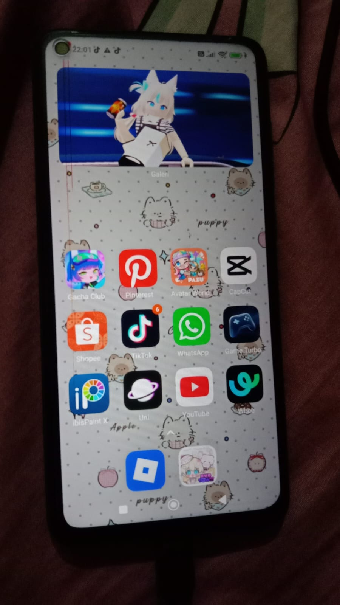

2. Tas

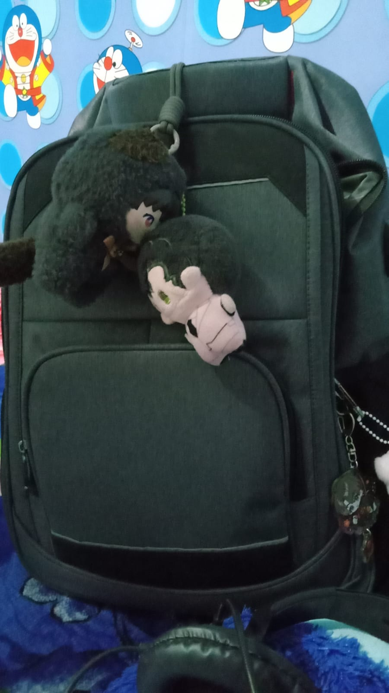

3. Pulpen

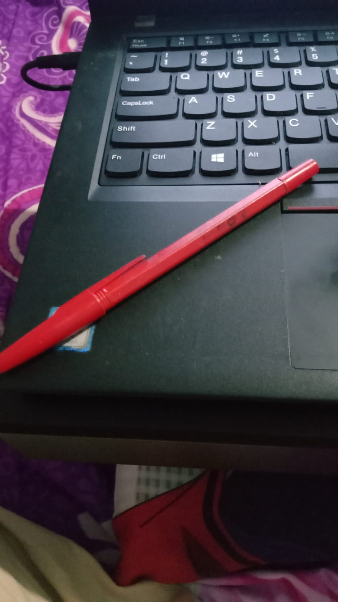

4. Pensil

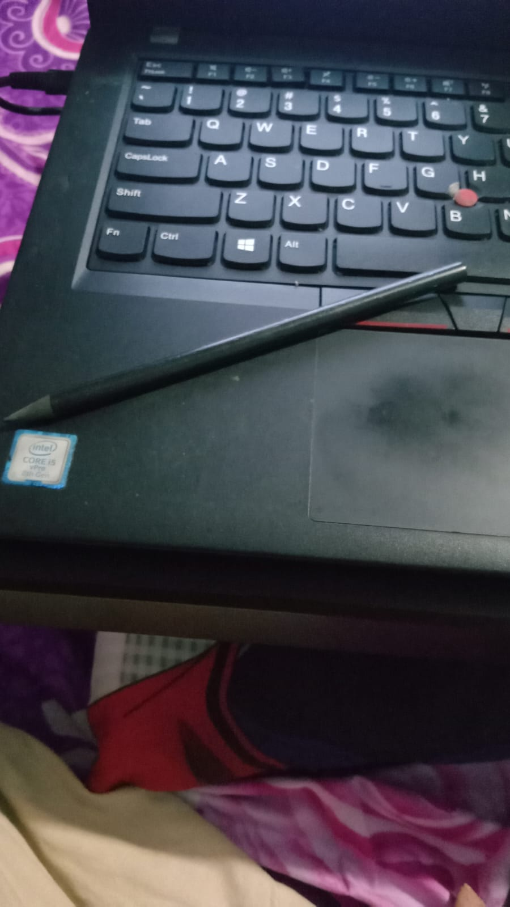

### class HP.java

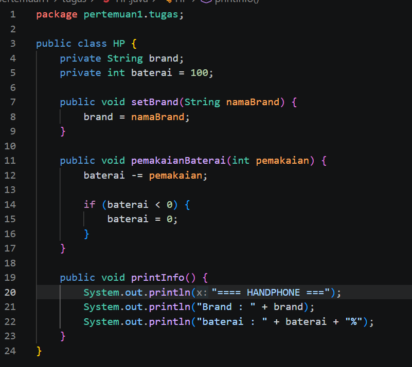

### class tas.java

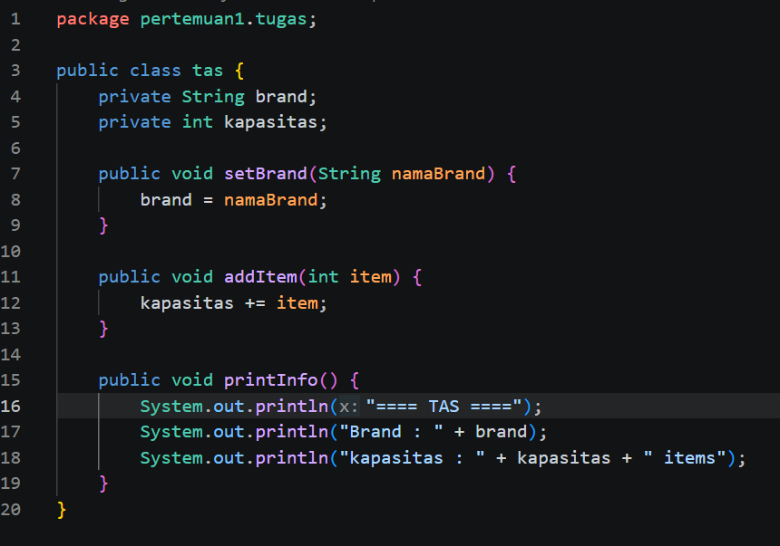

### class alatTulis.java

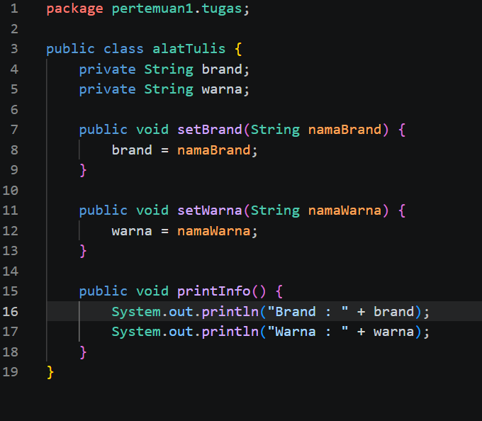

### class pensil.java

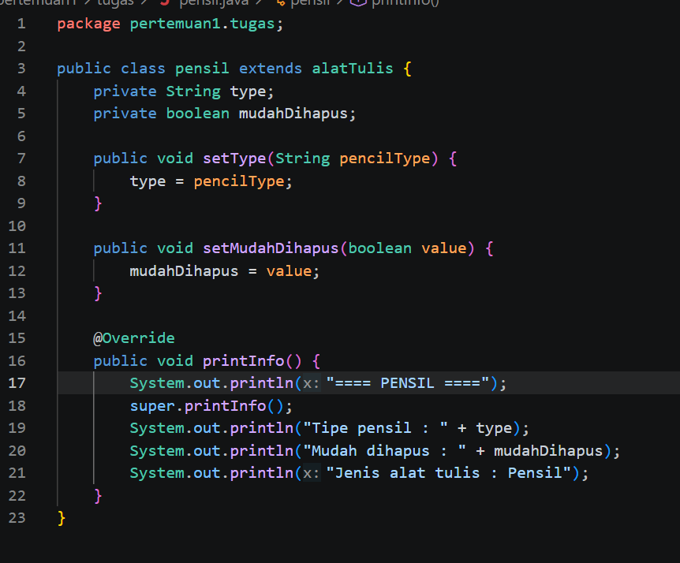

### class pulpen.java

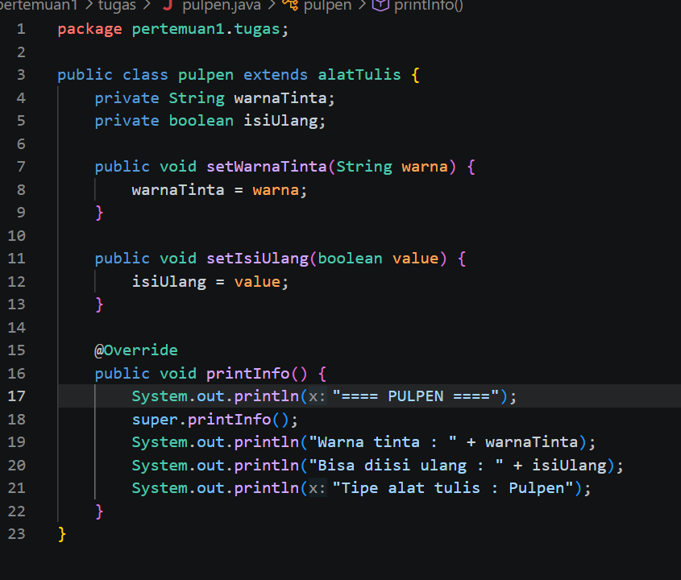

### class demo.java

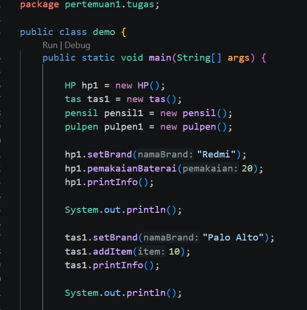

### Hasil output

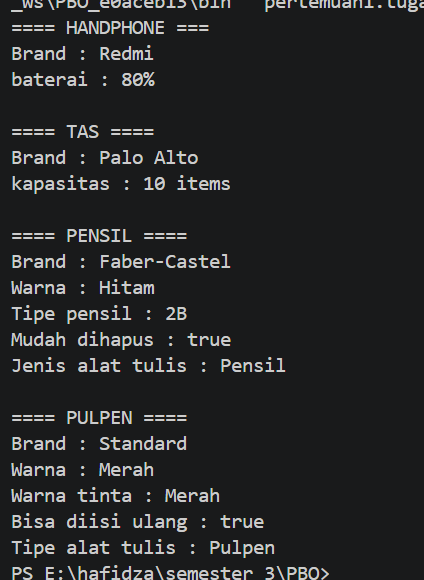